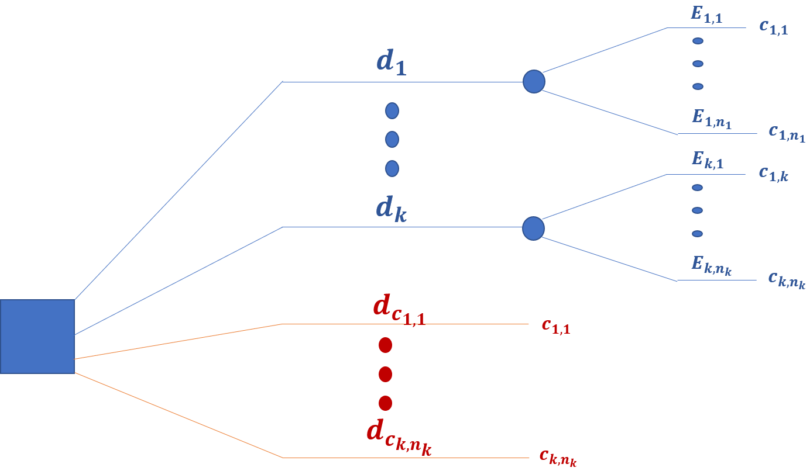
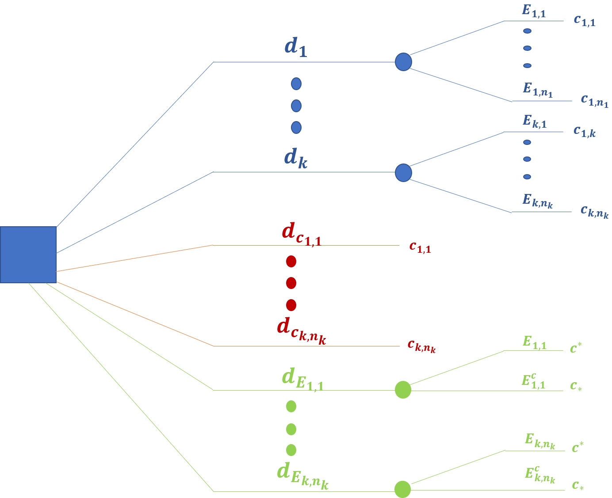
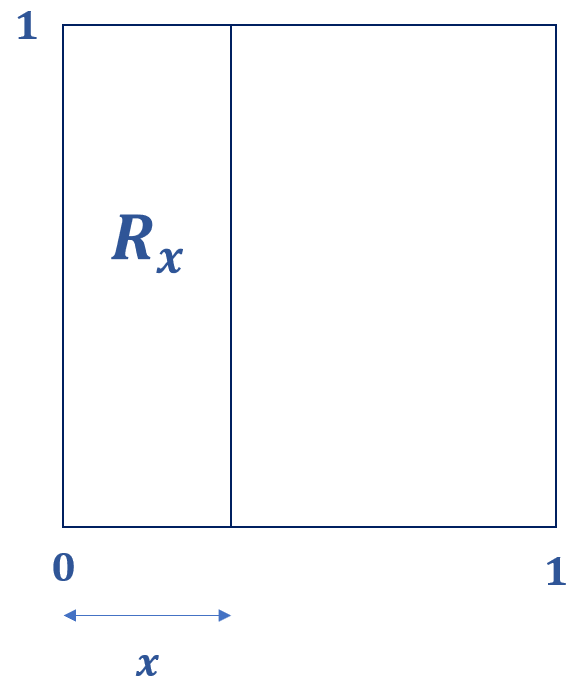
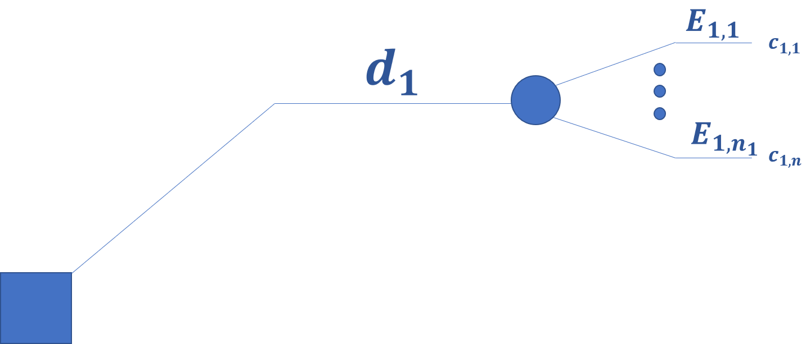
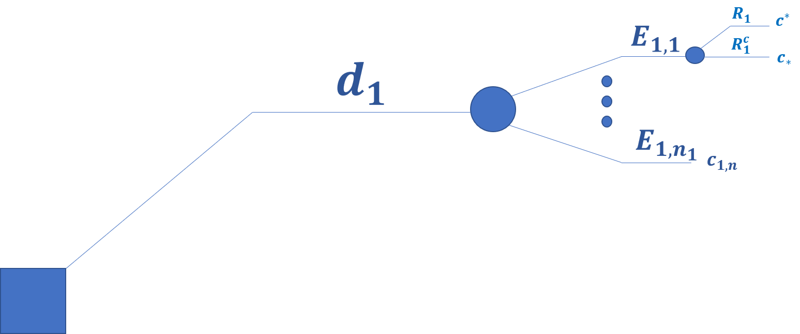
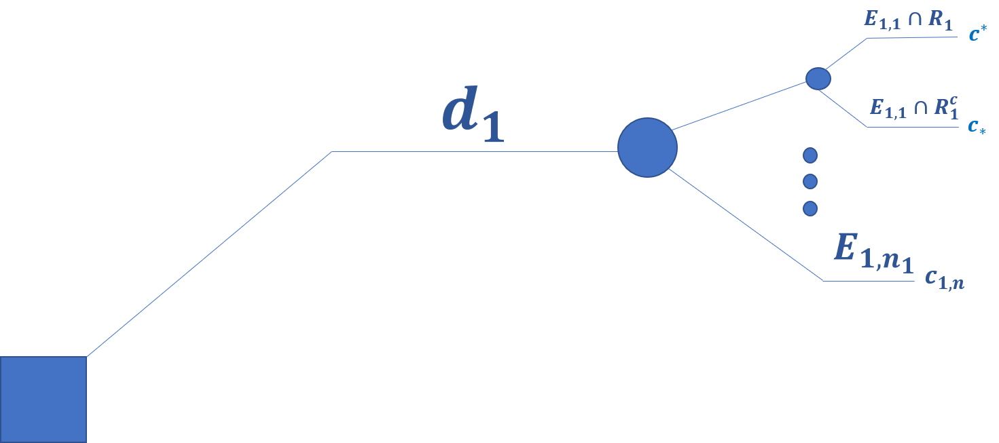

```{r setup, include=FALSE}
options(htmltools.dir.version = FALSE)
knitr::opts_chunk$set(eval = TRUE)
```

class: title-slide, middle

.pull-left[ 
# Métodos Estadísticos Bayesianos con R
## Criterio Óptimo
### Gibrán Peniche
### v. 0.0.1
### 2020-06-25
####  <i class="fab fa-github"></i> [jgpeniche](https://github.com/jgpeniche)
####  <i class="fab fa-twitter"></i> [PenicheGibran](https://twitter.com/PenicheGibran)
####  <i class="fab fa-google"></i> jgpeniche@gmail.com

]

.pull-right[


]

---
# La sesión pasada

--

### Formalizamos el problema de Decisión

--

- $(\mathbb{D}, \mathbb{C}, \mathfrak{E}, \prec)$

--

### Árboles de decisión

--

### Axiomas de Coherencia

--

1. Axioma de Comparabilidad

--

2. Axioma de Transitividad

--

3. Axioma de Sustituibilidad

--

4. Axioma de Eventos de Referencia

---

# Agenda

--

###  1. Criterio Óptimo de Decisión

---

# Resolviendo el problema de Decisión

--

### Sea $(\mathbb{D}, \mathbb{C}, \mathfrak{E}, \prec)$ un problema de decisión en **ambiente de incertidumbre** que enfrenta el *tomador de decisiones*

--

```{r arbol1, echo = FALSE, out.width= 250, out.height = 250, fig.align = 'center' }

knitr::include_graphics('figs/arbol2.png')

```


--


### ¿Cómo Resolvemos el problema?

---

class: inverse, center, middle
# 1
--

## 'Amplificamos' $\mathbb{D}$

---

# Amplificando $\mathbb{D}$

--

Comenzamos por definir $\mathbb{D}_1$ *.,.* $\mathbb{D} \subseteq \mathbb{D}_1$ donde añadimos las opciones **ficticias** de la forma $d_c = \{c | \Omega \}$ $\forall$ *c* $\epsilon$ $\mathbb{C}$

--

Estas son una colección de opciones que conducen a la consecuencia *c* de forma *segura*

--

En otras palabras estas opciones son **ciertas**

--


**OJO:** Esta colección de opciones **NO** está disponible para el tomador de decisiones

---
<br>

```{r arbol2, echo = FALSE, out.width= 600, out.height = 450, fig.align = 'center' }



```


---

class: inverse, center, middle
# 2
--

## Amplificamos $\mathbb{D}_1$

---

# Amplificando $\mathbb{D}_1$

--

Definimos $\mathbb{D}_2$ *.,.* $\mathbb{D}_1 \subseteq \mathbb{D}_2$ donde añadimos las opciones **ficticias** de la forma $d_E = \{c_* | E^c, c^*|E \}$ $\forall$ *E* $\epsilon$ $\mathfrak{E}$

--

Estas son una colección de opciones *binarias* del 'tipo volado' que solo conducen al cielo o al infierno

---

<br>

```{r arbol3, echo = FALSE, out.width= 750, out.height = 450, fig.align = 'center' }



```
---

class: inverse, center, middle
# 3

--

## Amplificamos $\mathbb{D}_2$

---

# Amplificando $\mathbb{D}_2$

--

Definimos $\mathbb{D}_3$ *.,.* $\mathbb{D}_2 \subseteq \mathbb{D}_3$ donde añadimos las opciones **ficticias** de la forma $d_R = \{c_* | R^c, c^*|R \}$ $\forall$ *R* $\subseteq$ $I$

--

Estamos ante un 'abuso' de notación ya que orginalmente definimos (Axioma IV) las regiones en términos de un evento aleatorio $z$

--

Sin embargo, para aliviar la notación definimos $d_{R_z} = d_R$

---

background-image: url('figs/jungla.jpg')
background-position: center
background-size: contain

---

# Algunas observaciones

--

- Tenemos ahora tantas ramas en nuestro arbol como regiones en $I$ que es infinita no-mumerable

--

A pesar de esto, por construcción, todos nuestros axiomas siguen aplicando en nuestro conjunto amplificado $\mathbb{D}_3$

--

- Notamos que podemos expresar a la opción $d_i$ en términos de las consecuencias y los eventos inciertos como $d_i = \{ c_{i,1} |E_{i,1}, ..., c_{i,n_i}|E_{i,n_i} \}$

--

- Para resolver nuestro problema nosostros andamos buscando $d^*$ $\epsilon$ $\mathbb{D}$ (no en $\mathbb{D}_3$) *.,.* $d \preceq d^*$ $\forall$ $d$ $\epsilon$ $\mathbb{D}$

--

### ¡Resolvamos el problema!

---

class: center, middle
# Pero antes...
--

# Un axioma técnico

---

class: inverse, center, middle
# Axioma 5
--

## DENSIDAD

---

# Axioma de Densidad

El conjunto de opciones $d_R$, con $R \subseteq I$, es *densa* respecto de la relación de preferencia en $\mathbb{D}_3$

--

Esto es $\forall d$ $\epsilon$ $\mathbb{D}_3$ $\exists$ $d_R$ *.,.* $d \sim d_R$

--

Esto lo que quiere decir es que podemos encontrar una equivalencia entre las opciones y las regiones en $R$ para medir preferencias

---

# Algunas consecuencias del Axioma 5

--

Ahora, gracias al axioma V sabemos que podemos encontrar una región lo suficientemente **creible** *.,. nos de lo mismo* que una opción **segura**, esto es:

--

$$\Longrightarrow \{c|\Omega \} \sim \{c_*|R^c, c^*|R \}$$

--

$\forall$ $c$ $\epsilon$ $\mathbb{C}$ y $R$ $\subseteq$ $I$

--

Más aún, podemos encontrar siempre una región *.,.*

--

$$\Longrightarrow d_E = \{c_* | E^c, c^* | E \} \sim  \{ c_* | R^c, c^* | R \} = d_R$$

--

$\forall$ $E$ $\epsilon$ $\mathfrak{E}$ y $R$ $\subseteq$ $I$

---

# Más consecuencias del Axioma 5

--

```{r square, echo=FALSE, fig.align = 'center', out.height = 300, out.width = 300}



```

--

Las $Area(R_x) = x$ $\therefore$

--

  + $Area(R_x) = 0$ $\Longleftrightarrow$ $x = 0$ $\Longleftrightarrow$ $d_{R_0} = \{ c_* | \Omega \} = c_*$
  
--

  + $Area(R_x) = 1$ $\Longleftrightarrow$ $x = 1$ $\Longleftrightarrow$ $d_{R_1} = \{ c^* | \Omega \} = c^*$
  
---

class: inverse, center, middle
# Resolvamos el problema

---

# Resolviendo el problema de decisión

--

Consideremos $d$ $\epsilon$ $\mathbb{D}$ $\subseteq$ $\mathbb{D}_3$ *.,.* $d = \{c_1|E_1, ... , c_k |E_k \}$

--

```{r arbol4, fig.align='center', out.height=200, out.width=400, echo=FALSE}



```

--

Sabemos que $\exists$ $R_1 \subseteq I$ *.,.* $c_1 \sim R_1$ ( $c_1 \sim \{c_*|R^c , c^* | R \}$ y $Area(R_1) = u_0(c_1)$ )

---

# Resolviendo el problema de decisión

Sea $$d^{(1)} = \{d_{R_1}|E_1, c_2|E_2, ... , c_k | E_k  \}$$

--

$$= \{ [c_*|R_1^c, c^*|R_1]|E_1, c_2|E_2, ... , c_k | E_k  \}$$
--

```{r arbol5, fig.align='center', out.height=200, out.width=400, echo=FALSE}



```
---

# Resolviendo el problema de decisión

Si ocurre $E_1$ ó $E_1^c$ $\longrightarrow$ $d$ y $d^{(1)}$ son igualmente preferibles

--

$\Longrightarrow$ por **AIII** (Sustituibilidad) $d_1$ $\sim$ $d^{(1)}$ (OJO: $d$ $\neq$ $d^{(1)}$ )

--

Además, notamos que:

```{r arbol6, fig.align='center', out.height=200, out.width=600, echo=FALSE}



```

--

$$\Longrightarrow d^{(1)} = \{ c_* | E_1 \cap R_1^c , c^* | E_1 \cap R_1, c_2 |E_2, ... , c_k |E_k \}$$

---

# Resolviendo el problema de decisión

Analogamente $\exists$ $R_2 \subseteq I$ *.,.* $c_2 \sim \{c_* | R_2^c , c^* | R_2 \}$

--

Repitiendo el procedimiento anterior definimos $d^{(2)} = \{ c_* | E_1 \cap R_1^c , c^* | E_1 \cap R_1, c_* | E_2 \cap R_2^c , c^* | E_2 \cap R_2, ... , c_k |E_k  \}$

--

Por **AIII** $d^{(2)} \sim d^{(1)}$ pero $d^{(1)} \sim d_1$ y por **AII** (Transitividad) $d^{(2)} \sim d_1$

--

Realizando el mismo procedimiento k - veces, obtenemos $$d^{(k)} = \{ c_* | E_1 \cap R_1^c , c^* | E_1 \cap R_1, c_* | E_2 \cap R_2^c , c^* | E_2 \cap R_2, ... , c_* | E_k \cap R_k^c , c^* | E_k \cap R_k  \}$$

--

$$= \{ [c_* | R_1^c , c^* | R_1] | E_1, ... , [c_* | R_k^c , c^* | R_k] | E_k  \}$$

--

$$= \{ c_* | A^c , c^* | A\}$$

---

# Resolviendo el problema de decisión

Donde $A = \cup_{i=1}^{k} (R_i \cap E_i)$

--

Más aún $A_j = \cup_{i=1}^{k_j} (R_{j,i} \cap E_{j,i})$ $\forall$ $j = 1, ..,k$

---

class: center, middle
# ¿Bajo qué condiciones $d_1 \sim d_1^{(k)} \prec d_2^{(k)} \sim d_2$?

---

# ¿Bajo qué condiciones $d_1 \sim d_1^{(k)} \prec d_2^{(k)} \sim d_2$?

$d_1^{(k)} \prec d_2^{(k)}$ $\Longleftrightarrow$ $A_1$ es **más** *creible* que $A_2$ 

--

Esto se debe a que estamos comparando decisiones binarias del tipo volado

--

$\Longleftrightarrow$ $$P(A_1 | H) < P(A_2 | H) = P(A_1) < P(A_2)$$

---

# ¿Bajo qué condiciones $d_1 \sim d_1^{(k)} \prec d_2^{(k)} \sim d_2$?


Pero $$P(A_j) = P[ \cup_{i=1}^{k_i = 1}(E_{j,i} \cap R_{j,i} )]$$

--

$$= \sum_{i=1}^{k_i} P(E_{j,i} \cap R_{j,i})$$ 


---

# ¿Bajo qué condiciones $d_1 \sim d_1^{(k)} \prec d_2^{(k)} \sim d_2$?

Por probabilidad condicional

$$= \sum_{i=1}^{k_i} P(E_{j,i}) P( R_{j,i}|E_{j,i})$$

--

Por independencia


--

$$= \sum_{i=1}^{k_i} P(E_{j,i}) P( R_{j,i})$$

---

# ¿Bajo qué condiciones $d_1 \sim d_1^{(k)} \prec d_2^{(k)} \sim d_2$?

--

Por otro lado sabemos que $P(R_{j,i})= A(R_{j,i})$

--

Pero, por definición, $A(R_{j,i}) = u_o(c_{j,i})$ (pues $c_{j,i} \sim R_{j,i}$ )

--

$$\therefore d_1 \prec d_2$$

--

$$\Longleftrightarrow P(A_1) < P(A_2)$$

--

$$\Longleftrightarrow \sum_{i=1}^{k_1}P(E_{1,i})P(R_{1,i}) < \sum_{i=1}^{k_1}P(E_{2,i})P(R_{2,i})$$

--

$$\Longleftrightarrow \sum_{i=1}^{k_1}P(E_{1,i})u_0(c_{1,i}) < \sum_{i=1}^{k_1}P(E_{2,i})u_0(u_{2,i})$$


---

class: center, middle
# $d_1 \prec d_2  \Longleftrightarrow$

--

# $\mathbb{E} \{u_0(d_1,E) \} < \mathbb{E} \{u_0(d_2,E) \}$

---

class: inverse, center, middle
# TEO

--

# Dados los axiomas de coherencia la *decisión óptima* en $\mathbb{D}$ es la que maximiza la utilidad (canónica) esperada

---

# ¡Resolvamos el problema de decisión!

--

Del teorema anterior se desprende lo siguiente

--

- Toda forma de incertidumbre se debe y se puede cuantificar con una función de probabilidad subjetiva

--

- La preferencia de toda consecuencia se debe y se puede cuantificar con una función de utilidad

--

- El algoritmo para resolver el problema de decisión es el siguiente

--

  1. Asignar la probabilidad subjetiva de todo evento incierto reelevante en el problema

--

  2. Asignar la utilidad canónica de toda consecuencia en el problema

--

  3. Maximizar la utilidad esperada

---

class: inverse, center, middle
# ¿Cuál es el problema de inferencia?

--

# Escoger $d_{\theta}$ que conduzca a $\theta$ en el espacio parametral $\Theta$

---

# ¿Qué hemos logrado hasta ahora?

--

Hasta ahora nuestro algoritmo de 3 pasos se ocupa de colecciones finitas de $( \mathbb{D}, \mathbb{C} ,\mathfrak{E})$

--

Sin embargo, el problema de inferencia generalmente involucra un conjunto infinito y posiblemente no numerable de elementos en el espacio de opciones

--

A pesar de esto sabemos que $u_0$ siempre va a existir y va a estar acotada y el problema es equivalente a encontrar el supremo

--

Para esto podemos aproximar el conjunto finito numerable de $E_{i,j}$ mediante un *familia paramétrica*

---

# ¿Qué sigue?

--

1. Hablar del problema de inferencia


--


2. Definir la correspondencia entre utilidad y pérdida

--

3. Estimación puntual 

--

4. Modelos conjugados