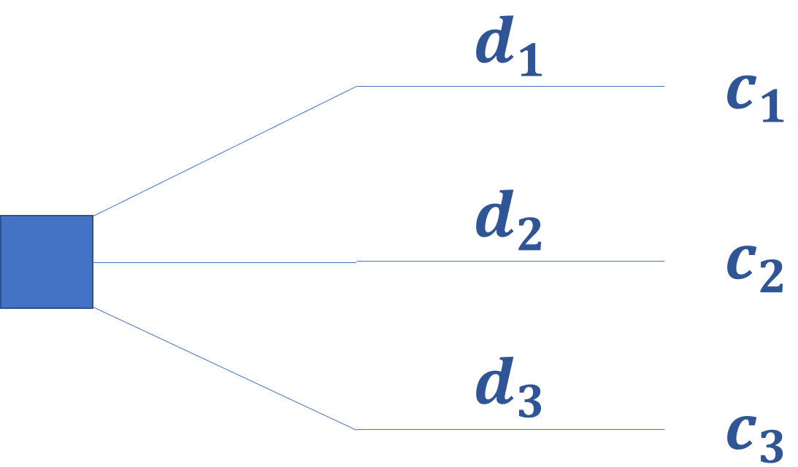
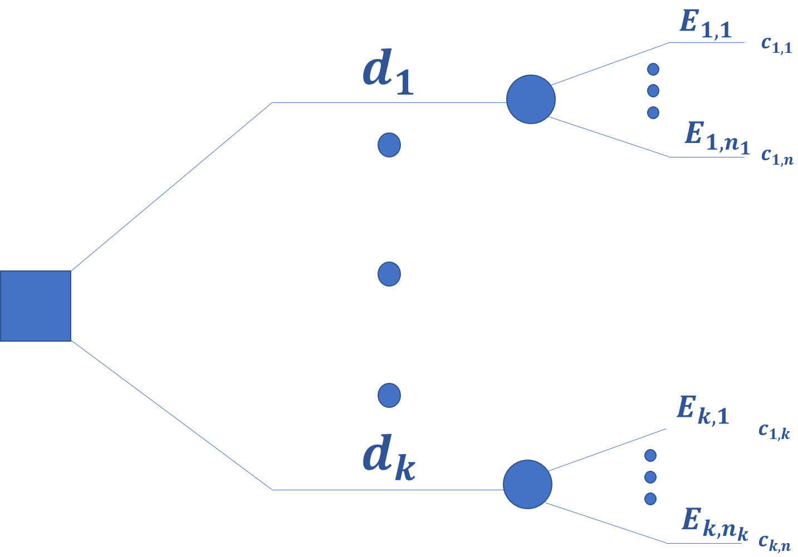
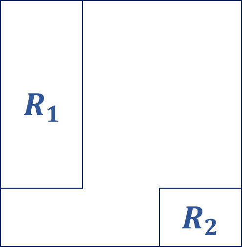

```{r setup, include=FALSE}
options(htmltools.dir.version = FALSE)
knitr::opts_chunk$set(eval = TRUE)
```

class: title-slide, middle

.pull-left[ 
# Métodos Estadísticos Bayesianos con R
## Problemas de Decisión
### Gibrán Peniche
### v. 0.0.1
### 2020-06-15
####  <i class="fab fa-github"></i> [jgpeniche](https://github.com/jgpeniche)
####  <i class="fab fa-twitter"></i> [PenicheGibran](https://twitter.com/PenicheGibran)
####  <i class="fab fa-google"></i> jgpeniche@gmail.com

]

.pull-right[


]

---
# La sesión pasada

--

### Platicamos sobre la finalidad de la inferencia

--

### Expusimos algunos de los problemas de la estadística frecuentista

--

### Concluimos que la estadística bayesiana no es una serie de técnicas, es una Teoría de Inferencia

---

# Agenda

--

###  1. ¿Qué es un problema de decisión?

--

###  2. Criterios de decisión
  
--

###  3. Teoría de decisión

--

###  4. Utilidad canónica

--

### 5. Probabilidad subjetiva
  
---

# Algunos problemas de decisión...

--

### ¿Qué platillo ordenar a la hora de la comida?

--

### ¿Qué alcohol comprar para la fiesta?

--

### ¿Qué ropa ponerse?

--

### ¿A qué hora levantarse en domingo?

???

_Comentar sobre las preferencias_

---

class: center, middle, inverse
# Formalizando el problema de decisión

---

# Formalizando el problema de decisión

--

¿Cómo formalizariamos matemáticamente el problema de decisión?

--

  - Un conjunto de *opciones* $\mathbb{D} = \{d_1 , ..., d_k \}$ que debe ser **exhaustivo** y **excluyente**
  
--

  - Un conjunto de consecuencias $\mathbb{C} = \{c_1, ... , c_k \}$ a través de las cuales podemos evaluar la i-ésima decisión. Esto implica que para cada decisión hay **una y solo una** consecuencia ( $d_i$ $\rightarrow$ $c_i$ )
  
--

Cabe resaltar que una condición necesaria para la *existencia* del problema de decisión es que exista una **una relación de preferencia** entre las consecuencias

--

  - Una relación binaria $\prec$ (o bien $\sim$) que indica que consecuencia es más *preferida* (*igualmente preferida*) que otra
  
???

_Comentar que esto sugiere que estas preferencias deben de tener ciertas características_

--

De esta manera nuestra definición *parcial* de un problema de decisón es la siguiente: $$(\mathbb{D}, \mathbb{C}, \prec)$$ 

--

Y un agente al que llamaremos el **tomador de decisiones**
  
---

# Un problema sin incertidumbre

**Problema**:

El tomador de decisiones debe de elegir **uno y solo un** elemento de $d_i$ $\epsilon$ $\mathbb{D}$ evaluandolo **a través de su consecuencia** $c_i$ $\epsilon$ $\mathbb{C}$

--

Si, en particular, nos enfrentaramos a un problema de decisión dónde hubiera **certidumbre** alrededor de todas las consecuencias la cosa es fácil:

--

  1. Identificar la consecuancia más preferida
  
--

  2. Identificar la opción que conduce a dicha consecuencia
  
--

  3. Elegir esa opción

--

A la representación visual de nuestro problema, se le conoce como *arbol de decisión* y en el caso de no incertidumbre se ve de la siguiente manera:

---

<br>
<br>
<br>

```{r, fig1, echo=FALSE,fig.align='center', out.width= 600, out.height= 400}

```


---

class: center, middle
# ¡Break!

---

# Robert O. Schlaifer

--

  - Era autoridad en esclavitud griega y motores de aviones en el siglo XIX
  
--

  - Solo tomó una curso de matemáticas a nivel licenciatura en su vida
  
--

  - Apasionado de resolver problemas prácticos 
  
--

  - Interesado en teoría de negocios: "Under uncertainty, the business man is forced, in effect, to gamble.."
  
--

  - Publicó *Probability and statistics for business decisions*, un libro de decisiones de negocios desde el punto de vista bayesiano
  
--

  - Inventó los árboles de decisión
  
---

# Un problema con incertidumbre

--

En nuestro día a día casi nunca tenemos certeza sobre las consecuencias del conjunto $\mathbb{C}$

--

La mayoría de las veces tenemos que enfrentarnos al problema de decisión, en el mejor de los casos, con poca información de lo que puede pasar...

--

Por esta razón incorporamos esta incertidumbre a nuestra definición matemática del problema de decisión...

--

  - $\mathfrak{E} = \{ E_1, ..., E_{n_1},..., E_k, ... ,E_{n_k} \}$ el conjunto de eventos inciertos
  
--

Así, nuestro problema de decisión queda formalmente definido por: $$(\mathbb{D}, \mathbb{C},\mathfrak{E} , \prec) $$

---

<br>
<br>
<br>
<br>
```{r, fig2, echo=FALSE, fig.align='center', out.width=700, out.height=350}

```
---

class: inverse, center, middle
# Resolviendo el problema de decisión

---

# Resolviendo el problema de decisión

--

Andamos buscando mecanismos/técnicas para " *podar* " nuestro arbol y solucionar nuestro problema de decisión

--

Algunas ideas son:

--

  1. Criterio **optimista**

--

  2. Criterio **pesimista**

--

  3. Consecuencia **más probable**
  
--

  4. Consecuencia **promedio**
  
--

  5. Consecuencia **esperada**
  
???

_Se poda el arbol dejando las peores consecuencias y se elije la menos peor_
  
--

### ¿Cuál de todos estos criterios es el mejor?

---

class: inverse, center, middle
# Teoría Axiomática de decisión

---
class: center, middle
# Objetivo:
--

## Contestar a la pregunta ¿cómo se debe resolver un problema de decisión en ambiente de incertidumbre?

---

# Axiomas de coherencia

???

_Comentar que no fueron tan egolatras para llamarlos de "racionalidad"_

--

### En 1954 Leonard J. Savage publicó *The foundations of statistics* el texto que propuso por primera vez una receta general para tomar decisiones

--

### Fué un matemático de la universidad de Michigan que trabajó de cerca con Milton Friedman

--

### En palabras de Friedman: " *one of the few people I have met whom I would unhesitatingly call a genius* "

--

### No es coincidencia que los axiomas que vamos a estudiar estén fuermente influenciados por la teoría de juegos y la teoría de utilidad


???

_mencionar que vamos a discutir los axiomas, que si se dan por aceptados ya no hay vuelta de hoja_
---

class: inverse, center, middle,
# 1

--

## COMPARABILIDAD

---

# Axioma de Comprabilidad
--

La relación de preferencia del tomador de decisiones es tal que para $d_i$ y $d_j$ $\epsilon$ $\mathbb{D}$ $\Longrightarrow$ necesariamente ocurre **una y solo una de las siguientes** :

--

  i. $d_i$ es más preferible que  $d_j$ ( $d_i \prec d_j$ )
  
--

  ii. $d_i$ es menos preferible que $d_j$ ( $d_j \prec d_i$ )
  
--

  iii. $d_i$ es igualmente preferible que $d_j$ ( $d_i \sim d_j$ )
  
--

Adicionalmente $\exists$ $c_*$ y $c^*$ $\epsilon$ $\mathbb{C}$ *.,.* $c_* \preceq c$ y $c \preceq c^*$ $\forall$ $c$ $\epsilon$ $\mathbb{C}$

???

_Comentar sobre la existencia de cotas de preferencia, y bautizar al cielo y al infierno_

---

class: inverse, middle, center
# 2
--

## TRANSITIVIDAD

---

# Axioma de Transitividad

--

La relación de preferencias del tomador de decisiones es tal que para $\{ d_i, d_j, d_k \}$ $\epsilon$ $\mathbb{D}$ ocurre que si $d_i \prec d_j$ y $d_j \prec d_k$ $\Longrightarrow$ necesariamente $d_i \prec d_k$

--

Equivalentemente decimos que si $d_i \sim d_j$ y $d_j \sim d_k$ $\Longrightarrow$ necesariamente $d_i \sim d_k$


---

class: inverse, center, middle
# 3
--

## SUSTITUIBILIDAD

---

# Axioma de Sustituibilidad

--

También se le conoce cómo principio de la cosa segura

--

Para $\{d_i, d_j \}$ $\epsilon$ $\mathbb{D}$ y $A$ es un suceso incierto. Si ocurre que $d_i \prec d_j | A$ y  $d_i \prec d_j | A^c$ $\Longrightarrow$ $d_i \prec d_j$

???

_Comentar que estamos partiendo de que nuestro tomador de decsiones en nuestro mundo es capaz de hacer todo lo anterior_


---

class: center, middle, inverse
# 4
--

## EVENTOS DE REFERENCIA

---

# Axioma de Eventos de Referencia

--

El tomador de decisiones puede imaginar un mecanismo para generar puntos en el cuadrado unitario $I$ $\epsilon$ $\mathbb{R}^2$ de tal manera que si $R_1$ y $R_2$ con dos regiones de $I$ $\Longrightarrow$ el evento $\{ z$ $\epsilon$ $R_1 \}$ es más **creible** que el evento $\{ z$ $\epsilon$ $R_2 \}$ $\Longleftrightarrow$ Área( $R_1$ ) > Área( $R_2$ )

<br>

--
```{r evref, echo=FALSE, fig.align='center',out.height=200,out.width=200}



```


--

<br>
**OJO**: La ocurrencia de esto eventos del tipo 'z' es *independiente* de los eventos inciertos de nuestro problema de decisión

???

_Confrontarlos con que es el más raro, pero el punto es que si ellos se lo pueden imaginar_

---

class: center, inverse, middle
# UTILIDAD

---

# Utilidad 

--

Habíamos dicho más atrás que el *tomador de decisiones* **EVALÚA** cada opción a partir de su consecuencia

--

Lo que no puntualizamos más atrás es el **CÓMO** realiza esta evaluación...

--

**Def: UTILIDAD CANÓNICA** 

--

Sea $c$ una consecuencia cualquiera en $\mathbb{C}$. Definimos entonces la *utilidad canónica* $u_0$ de $c$ como el área de una región $R$ $\epsilon$ $I$ .,.

--

$$u_0(c) = Área(R)$$

--

$$u_0: \mathbb{C} \rightarrow [0,1]$$
---

# Utilidad conónica

**Pregunta:**

--

¿Porqué se llama *utilidad* y se apellida *canónica*?

--

**R:** La función $u_0$ tal cómo está definida es una función monótona que **respeta el ordenamiento de la preferencias** dado por $\prec$, además esta función **existe** y es **única** como consecuencia de los axiomas de coherencia 

--

**TEO**

Sean $c_i$ y $c_j$ $\epsilon$ $\mathbb{C}$ $\Longrightarrow$ $c_i$ $\prec$ $c_j$ $\Longleftrightarrow$ $u_o(c_i)$ < $u_0(c_j)$

--

Además $u_0(c_*) = 0$ y $u_0(c^*) = 1$

---

# Probabilidad subjetiva

--

Tampoco hemos hablado de los eventos inciertos de nuestro problema de decisión ni de los mecanismos que tiene el tomador de decisiones para cuantificar el nivel de incertidumbre asociado a los mismos

--

**Def: PROBABILIDAD SUBJETIVA**

--

Sea $E$ $\epsilon$ $\mathfrak{E}$ un evento incierto relevante. Definimos la probailidad subjetiva del evento $E$ como el área de $R$ $\subseteq$ $I$ .,.

--

$$P(E|H) = Área(R)$$

--

$H$ denota la **información** con la que cuenta el tomador de decisiones con respecto del evento incierto $E$ al momento de tomar la decisión

--

Esta proabilidad **existe** y es **única** como consecuencia de los axiomas de coherencia

---

# Probabilidad Subjetiva

**TEO**

La función de probabilidad $P(E|H)$ definida sobre los eventos inciertos, satisface los axiomas de Kolmogorov


---

class: center, middle
# ¡¡¡ $\Longrightarrow$ los axiomas de Kolmogorov son una consecuencia de los axiomas de coherencia !!!

---

class: center, middle, inverse
# ¿Qué sigue?

---

# ¿Qué sigue?

--

**PRIMERO**

--

Deducir el criterio óptimo para tomar decisiones con base en nuestro recién creado cuerpo axiomático

--

**SEGUNDO**

--

Aterriar nuestra teoría al caso de inferencia

--

**TERCERO**

--

Hacer inferencia bayesiana

---

class: center, middle, inverse
# Ya no se vale echarse para atrás

--

## Tampoco hacer menjurjes...
